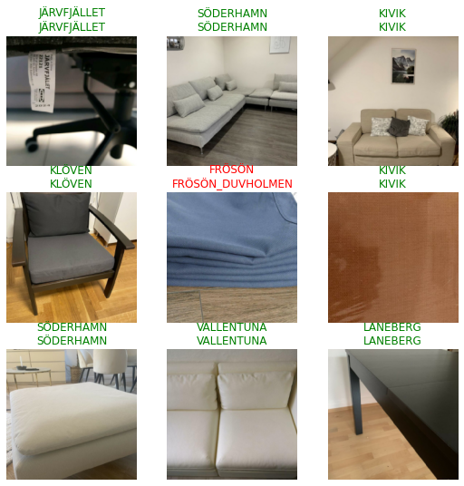

<!-- PROJECT LOGO -->
 

  <h3 align="center">Ebay_Kleinanzeige_Image_Scraper</h3>

  

    Scraping pictures from Ebay Kleinanzige websites
  

<!-- ABOUT THE PROJECT -->
### About The Project

This script was developed as part of a bachelor thesis at HTW Berlin.
It allows to collect image files from ebay-kleinanzeigen.de website in order to train an artificial intelligence model to recognize ikea store products. 
The model used in the IKEA_classifier application is part of the final project.

### How to use

To start collecting images from the ikea website, please open the jupiter notebook in [Google Colab](https://colab.research.google.com/drive/1hOcuZJ_1B5fV5EHMvxtlfyTGhy_meC1z?usp=sharing) and follow the instructions

### Table of content
  1. Libraries and constants definition
  1.1 Import libraries
  1.2 Define headers to be visible as the Google Bot.
  1.3 Mount storage
  2. Function definition
  2.1 Create BeautifulSoup instance
  2.2 Creates a list of URL adresses in Ebay Kleinanzeige service of one item
  2.3 Create a list of images sources
  3. Execution
  3.1 Open a list of items
  3.2 Create a list of ebay items based of the list of items names
  3.4 Change directory to save the itemsList (optional)
  3.5 Save the list of IKEA Products to JSON file (optional)
  3.6 Set your train ditrectory to save download images 
  3.7 Scrape images to selected directory and create list of labels

### Built With

* [Google Colab](https://colab.research.google.com/)
* [Python](https://www.python.org/)
* [BeautifulSoup](https://www.crummy.com/software/BeautifulSoup/bs4/doc/#)

<!-- CONTACT -->
### Contact

Gregor Pawlak - [linkedIn](https://www.linkedin.com/in/grzegorz-pawlak/) 

Project Link: [https://github.com/Greqorian/Ebay_Kleinanzeige_Image_Scraper](https://github.com/Greqorian/Ebay_Kleinanzeige_Image_Scraper)
